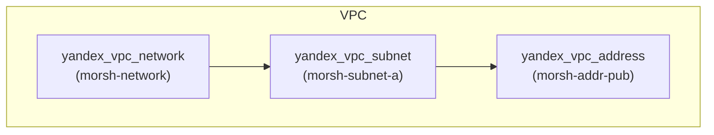
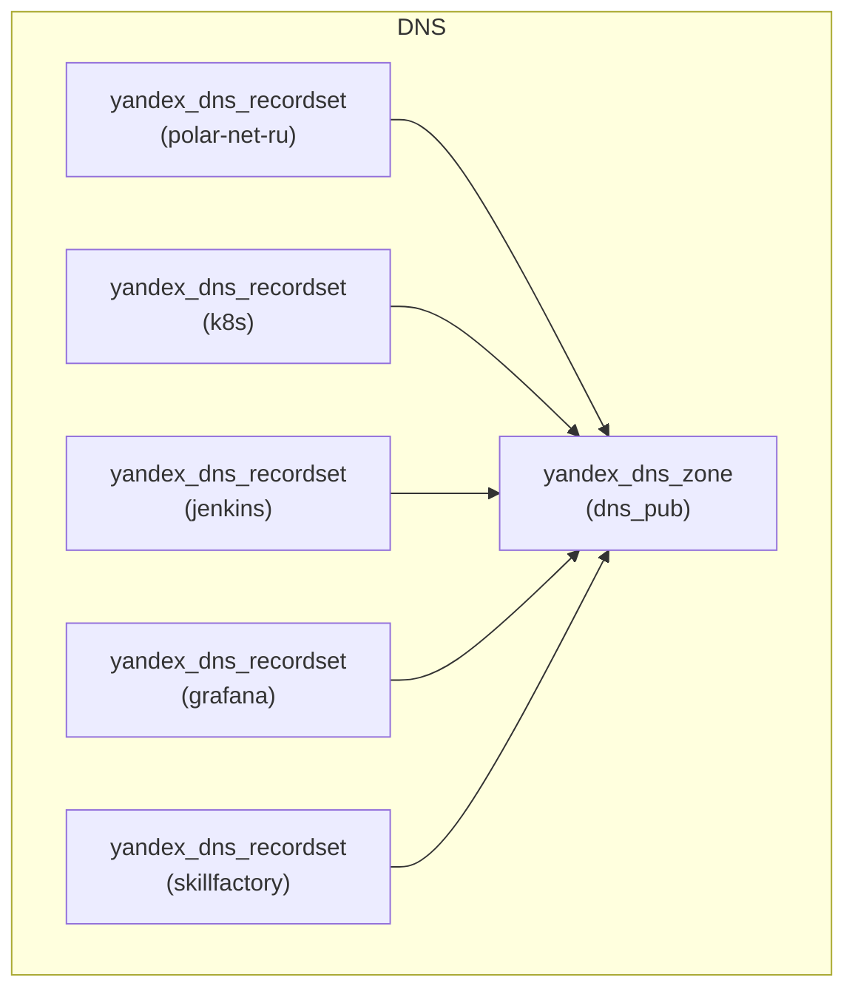
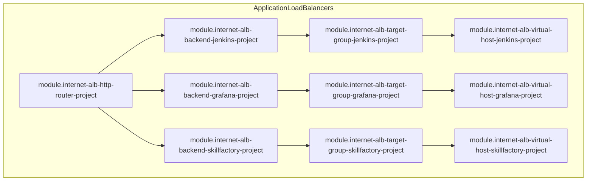
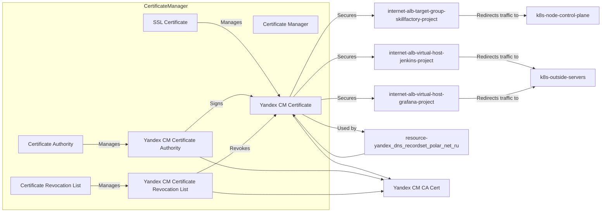

```mermaid

graph TD

    subgraph Local Files
        local_file_ansible_template --> templatefile --> local_file_ansible_inventory_template
        local_file_cloud_init_yaml_tpl --> templatefile --> local_file_cloud_init_yaml_tpl
        local_file_cloud_init_k8s_node_deb_yaml_tpl --> templatefile --> local_file_cloud_init_k8s_node_deb_yaml_tpl
        local_file_cloud_init_ci_cd_monitor_deb_yaml_tpl --> templatefile --> local_file_cloud_init_ci_cd_monitor_deb_yaml_tpl
        local_file_raw_secrets_sf_web_app_template --> templatefile --> local_file_raw_secrets_sf_web_app
        local_file_raw_secrets_infra_template --> templatefile --> local_file_raw_secrets_infra
        local_file_provisioning_yaml_tpl_template --> templatefile --> local_file_provisioning_yaml
        local_file_promtail_release_yaml_tpl --> templatefile --> local_file_promtail_release_yaml
        tls_private_key_key --> local_file_private_key
    end

    subgraph Destination Files
        local_file_raw_secrets_infra --> destination_file_raw_secrets_infra.yaml
        local_file_raw_secrets_sf_web_app --> destination_file_raw_secrets_sf_web_app.yaml
        local_file_promtail_release_yaml --> destination_file_promtail_release.yaml
        local_file_provisioning_yaml --> destination_file_provisioning.yaml
        local_file_ansible_inventory_template --> destination_file_yandex_inventory.ini
        local_file_private_key --> destination_file_SSH_KEY_FINAL
    end



```

# SkillFactory Diploma Work

* *Ссылки которые связаны с проектом.*

## [Skillfactory Diploma Work Web App](https://github.com/Morshimus/SkillFactory-Diploma-Work-Web-App) - Приложение написанное на framwork Django, язык python3

## [Skillfactory Diploma Work CI Role](https://github.com/Morshimus/SkillFactory-Diploma-Work-CI-Role) - Роль Ansible для деплоя CI\CD Jenkins Piplines

## [Skillfactory Diploma Work Prometheus Stack Role](https://github.com/Morshimus/SkillFactory-Diploma-Work-Loki-Prom-Grafana-Role) - Роль Ansible для деплоя кластера мониторинга Prometheus с Loki и Grafana

## [Skillfactory Diploma Work Helm Charts](https://github.com/Morshimus/SkillFactory-Diploma-Work-Helm-Charts) - Helm шаблон для приложения, плюс модифицированный шаблоны promtail и  postgresql. Работает как helm репозиторий









```mermaid
graph LR

subgraph ComputeInstances
    ComputeInstances[Compute Instances] -- Contains --> k8s-node-control-plane[k8s-node-control-plane]
    ComputeInstances -- Contains --> k8s-node-worker[k8s-node-worker]
    ComputeInstances -- Contains --> k8s-outside-servers[k8s-outside-servers]

    k8s-node-control-plane -- Connects to --> k8s-node-control-plane-instance[k8s-node-control-plane Instance]
    k8s-node-worker -- Connects to --> k8s-node-worker-instance[k8s-node-worker Instance]
    k8s-outside-servers -- Connects to --> k8s-outside-servers-instance[k8s-outside-servers Instance]

    k8s-node-control-plane-instance --> k8s-node-control-plane-vm[Virtual Machine]
    k8s-node-worker-instance --> k8s-node-worker-vm[Virtual Machine]
    k8s-outside-servers-instance --> k8s-outside-servers-vm[Virtual Machine]

    k8s-node-control-plane-vm --> os-disk-control-plane[OS Disk]
    k8s-node-worker-vm --> os-disk-worker[OS Disk]
    k8s-outside-servers-vm --> os-disk-outside-servers[OS Disk]

    os-disk-control-plane --> yandex_compute_disk_control_plane[Yandex Compute Disk]
    os-disk-worker --> yandex_compute_disk_worker[Yandex Compute Disk]
    os-disk-outside-servers --> yandex_compute_disk_outside_servers[Yandex Compute Disk]

    yandex_compute_disk_control_plane --> yandex_compute_instance_control_plane[Yandex Compute Instance]
    yandex_compute_disk_worker --> yandex_compute_instance_worker[Yandex Compute Instance]
    yandex_compute_disk_outside_servers --> yandex_compute_instance_outside_servers[Yandex Compute Instance]

    yandex_compute_instance_control_plane --> yandex_vpc_subnet_morsh_subnet_a[Yandex VPC Subnet]
    yandex_compute_instance_worker --> yandex_vpc_subnet_morsh_subnet_a
    yandex_compute_instance_outside_servers --> yandex_vpc_subnet_morsh_subnet_a
end

```



<!-- BEGINNING OF PRE-COMMIT-TERRAFORM DOCS HOOK -->
## Requirements

| Name | Version |
|------|---------|
| <a name="requirement_terraform"></a> [terraform](#requirement\_terraform) | >= 1.3.5 |
| <a name="requirement_ansiblevault"></a> [ansiblevault](#requirement\_ansiblevault) | = 2.2.0 |
| <a name="requirement_local"></a> [local](#requirement\_local) | >= 2.3.0 |
| <a name="requirement_tls"></a> [tls](#requirement\_tls) | ~> 4.0 |
| <a name="requirement_yandex"></a> [yandex](#requirement\_yandex) | ~> 0.84.0 |

## Providers

| Name | Version |
|------|---------|
| <a name="provider_ansiblevault"></a> [ansiblevault](#provider\_ansiblevault) | 2.2.0 |
| <a name="provider_local"></a> [local](#provider\_local) | 2.4.0 |
| <a name="provider_tls"></a> [tls](#provider\_tls) | 4.0.4 |
| <a name="provider_yandex"></a> [yandex](#provider\_yandex) | 0.84.0 |

## Modules

| Name | Source | Version |
|------|--------|---------|
| <a name="module_internet-alb-backend-jenkins-project"></a> [internet-alb-backend-jenkins-project](#module\_internet-alb-backend-jenkins-project) | git::https://github.com/Morshimus/Terraform-Yandex-Cloud-Application-Load-Balancer-Backend-Group-Module | tags/1.1.3 |
| <a name="module_internet-alb-http-router-project"></a> [internet-alb-http-router-project](#module\_internet-alb-http-router-project) | git::https://github.com/Morshimus/Terraform-Yandex-Cloud-Application-Load-Balancer-Http-Router-Module | tags/1.1.0 |
| <a name="module_internet-alb-project"></a> [internet-alb-project](#module\_internet-alb-project) | git::https://github.com/Morshimus/terraform-yandex-cloud-application-load-balancer-module | tags/1.1.1 |
| <a name="module_internet-alb-target-group-jenkins-project"></a> [internet-alb-target-group-jenkins-project](#module\_internet-alb-target-group-jenkins-project) | git::https://github.com/Morshimus/Terraform-Yandex-Cloud-Application-Load-Balancer-Target-Group-Module | tags/1.1.1 |
| <a name="module_internet-alb-virtual-host-jenkins-project"></a> [internet-alb-virtual-host-jenkins-project](#module\_internet-alb-virtual-host-jenkins-project) | git::https://github.com/Morshimus/Terraform-Yandex-Cloud-Application-Load-Balancer-Virtual-Host-Module | tags/1.0.0 |
| <a name="module_k8s-node-control-plane"></a> [k8s-node-control-plane](#module\_k8s-node-control-plane) | git::https://github.com/Morshimus/yandex-cloud-instance-module | tags/1.1.2 |
| <a name="module_k8s-node-worker"></a> [k8s-node-worker](#module\_k8s-node-worker) | git::https://github.com/Morshimus/yandex-cloud-instance-module | tags/1.1.2 |
| <a name="module_k8s-outside-servers"></a> [k8s-outside-servers](#module\_k8s-outside-servers) | git::https://github.com/Morshimus/yandex-cloud-instance-module | tags/1.1.2 |

## Resources

| Name | Type |
|------|------|
| [local_file.private_key](https://registry.terraform.io/providers/hashicorp/local/latest/docs/resources/file) | resource |
| [local_file.yandex_inventory](https://registry.terraform.io/providers/hashicorp/local/latest/docs/resources/file) | resource |
| [tls_private_key.key](https://registry.terraform.io/providers/hashicorp/tls/latest/docs/resources/private_key) | resource |
| [yandex_cm_certificate.polar-net-ru](https://registry.terraform.io/providers/yandex-cloud/yandex/latest/docs/resources/cm_certificate) | resource |
| [yandex_compute_placement_group.group_cp](https://registry.terraform.io/providers/yandex-cloud/yandex/latest/docs/resources/compute_placement_group) | resource |
| [yandex_dns_recordset.grafana](https://registry.terraform.io/providers/yandex-cloud/yandex/latest/docs/resources/dns_recordset) | resource |
| [yandex_dns_recordset.jenkins](https://registry.terraform.io/providers/yandex-cloud/yandex/latest/docs/resources/dns_recordset) | resource |
| [yandex_dns_recordset.k8s](https://registry.terraform.io/providers/yandex-cloud/yandex/latest/docs/resources/dns_recordset) | resource |
| [yandex_dns_recordset.polar-net-ru](https://registry.terraform.io/providers/yandex-cloud/yandex/latest/docs/resources/dns_recordset) | resource |
| [yandex_dns_recordset.skillfactory](https://registry.terraform.io/providers/yandex-cloud/yandex/latest/docs/resources/dns_recordset) | resource |
| [yandex_dns_zone.dns_pub](https://registry.terraform.io/providers/yandex-cloud/yandex/latest/docs/resources/dns_zone) | resource |
| [yandex_vpc_address.morsh-addr-pub](https://registry.terraform.io/providers/yandex-cloud/yandex/latest/docs/resources/vpc_address) | resource |
| [yandex_vpc_network.morsh-network](https://registry.terraform.io/providers/yandex-cloud/yandex/latest/docs/resources/vpc_network) | resource |
| [yandex_vpc_subnet.morsh-subnet-a](https://registry.terraform.io/providers/yandex-cloud/yandex/latest/docs/resources/vpc_subnet) | resource |
| [ansiblevault_path.github-token](https://registry.terraform.io/providers/MeilleursAgents/ansiblevault/2.2.0/docs/data-sources/path) | data source |
| [ansiblevault_path.github-user](https://registry.terraform.io/providers/MeilleursAgents/ansiblevault/2.2.0/docs/data-sources/path) | data source |
| [ansiblevault_path.jenkins_agent_1_secret](https://registry.terraform.io/providers/MeilleursAgents/ansiblevault/2.2.0/docs/data-sources/path) | data source |
| [ansiblevault_path.jenkins_agent_2_secret](https://registry.terraform.io/providers/MeilleursAgents/ansiblevault/2.2.0/docs/data-sources/path) | data source |
| [ansiblevault_path.jenkins_archive_password](https://registry.terraform.io/providers/MeilleursAgents/ansiblevault/2.2.0/docs/data-sources/path) | data source |

## Inputs

| Name | Description | Type | Default | Required |
|------|-------------|------|---------|:--------:|
| <a name="input_cloud_id_yandex"></a> [cloud\_id\_yandex](#input\_cloud\_id\_yandex) | Cloud id of yandex.cloud provider | `string` | n/a | yes |
| <a name="input_dns_name_pub"></a> [dns\_name\_pub](#input\_dns\_name\_pub) | (Required) The DNS name this record set will apply to. | `string` | `"polar-dns"` | no |
| <a name="input_dns_zone_pub"></a> [dns\_zone\_pub](#input\_dns\_zone\_pub) | (Required) The DNS name of this zone, e.g. 'example.com.'. Must ends with dot. | `string` | `"polar.net.ru."` | no |
| <a name="input_folder_id_yandex"></a> [folder\_id\_yandex](#input\_folder\_id\_yandex) | Folder id of yandex.cloud provider | `string` | n/a | yes |
| <a name="input_k8s_node_cp"></a> [k8s\_node\_cp](#input\_k8s\_node\_cp) | Number of control plane nodes in k8s cluster. <br>For name:<br>  Key - is postfix<br>  Value - is prefix<br>For etcd\_member:<br>  Key - is name<br>  Value - is type | <pre>object({<br>    name        = map(string),<br>    etcd_member = map(bool)<br>  })</pre> | <pre>{<br>  "etcd_member": {<br>    "001": true<br>  },<br>  "name": {<br>    "001": "k8s-cp-polar-"<br>  }<br>}</pre> | no |
| <a name="input_k8s_node_worker"></a> [k8s\_node\_worker](#input\_k8s\_node\_worker) | Number of worker nodes in k8s cluster.<br>For name:<br>  Key - is postfix<br>  Value - is prefix<br>For etcd\_member:<br>  Key - is name<br>  Value - is type | <pre>object({<br>    name        = map(string)<br>    etcd_member = map(bool)<br>  })</pre> | <pre>{<br>  "etcd_member": {<br>    "002": false<br>  },<br>  "name": {<br>    "002": "k8s-worker-polar-"<br>  }<br>}</pre> | no |
| <a name="input_k8s_outside_srv"></a> [k8s\_outside\_srv](#input\_k8s\_outside\_srv) | Number of external servers outside of k8s cluster.<br>For name:<br>  Key - is postfix<br>  Value - is prefix<br>For ci-cd:<br>  Key - is name<br>  Value - is type<br>For monitoring:<br>  Key - is name<br>  Value - is type<br>For bastion:<br>  Key - is name<br>  Value - is type | <pre>object({<br>    name       = map(string)<br>    ci-cd      = map(bool)<br>    monitoring = map(bool)<br>    bastion    = map(bool)<br>  })</pre> | <pre>{<br>  "bastion": {},<br>  "ci-cd": {<br>    "003": true<br>  },<br>  "monitoring": {<br>    "003": true<br>  },<br>  "name": {<br>    "003": "srv-ext-polar-"<br>  }<br>}</pre> | no |
| <a name="input_network_name_yandex"></a> [network\_name\_yandex](#input\_network\_name\_yandex) | Created netowork in yandex.cloud name | `string` | `"morsh_vpc"` | no |
| <a name="input_os_disk_size"></a> [os\_disk\_size](#input\_os\_disk\_size) | Size of required vm | `string` | `"50"` | no |
| <a name="input_service_account_key_yandex"></a> [service\_account\_key\_yandex](#input\_service\_account\_key\_yandex) | Local storing service key. Not in git tracking | `string` | `"./key.json"` | no |
| <a name="input_subnet_a_description_yandex"></a> [subnet\_a\_description\_yandex](#input\_subnet\_a\_description\_yandex) | n/a | `string` | `"Subnet A for morshimus instances"` | no |
| <a name="input_subnet_a_name_yandex"></a> [subnet\_a\_name\_yandex](#input\_subnet\_a\_name\_yandex) | Subnet for 1st instance | `string` | `"morsh-subnet-a"` | no |
| <a name="input_subnet_a_v4_cidr_blocks_yandex"></a> [subnet\_a\_v4\_cidr\_blocks\_yandex](#input\_subnet\_a\_v4\_cidr\_blocks\_yandex) | IPv4 network for 1st instance subnet | `list(string)` | <pre>[<br>  "192.168.21.0/24"<br>]</pre> | no |
| <a name="input_useros"></a> [useros](#input\_useros) | n/a | `string` | `"morsh-adm"` | no |
| <a name="input_zone_yandex_a"></a> [zone\_yandex\_a](#input\_zone\_yandex\_a) | Zone of 1st instance in yandex cloud | `string` | `"ru-central1-a"` | no |

## Outputs

| Name | Description |
|------|-------------|
| <a name="output_external_servers_nodes_ip_priv"></a> [external\_servers\_nodes\_ip\_priv](#output\_external\_servers\_nodes\_ip\_priv) | n/a |
| <a name="output_external_servers_nodes_ip_pub"></a> [external\_servers\_nodes\_ip\_pub](#output\_external\_servers\_nodes\_ip\_pub) | n/a |
| <a name="output_k8s_cluster_nodes_ip_priv"></a> [k8s\_cluster\_nodes\_ip\_priv](#output\_k8s\_cluster\_nodes\_ip\_priv) | n/a |
| <a name="output_k8s_cluster_nodes_ip_pub"></a> [k8s\_cluster\_nodes\_ip\_pub](#output\_k8s\_cluster\_nodes\_ip\_pub) | n/a |
<!-- END OF PRE-COMMIT-TERRAFORM DOCS HOOK -->
