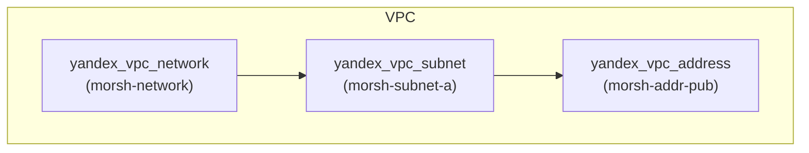
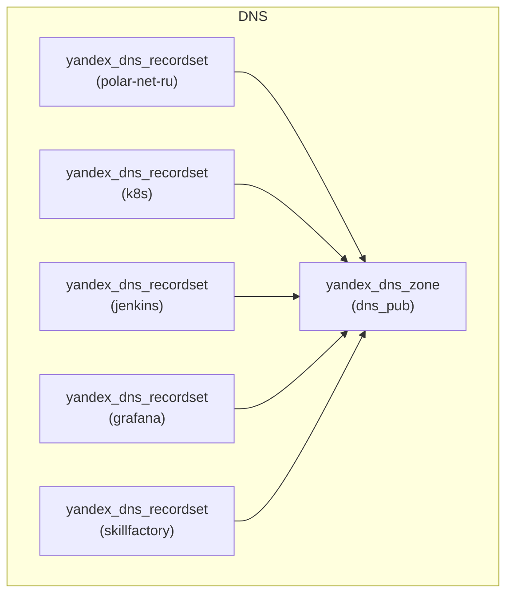
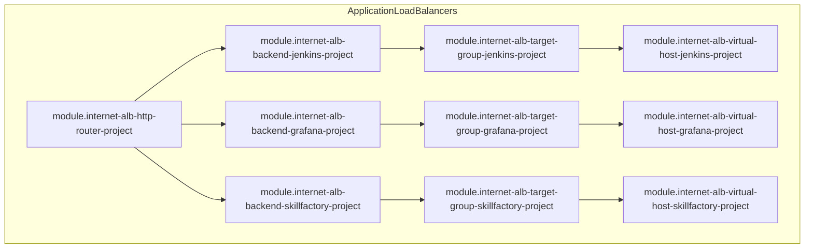
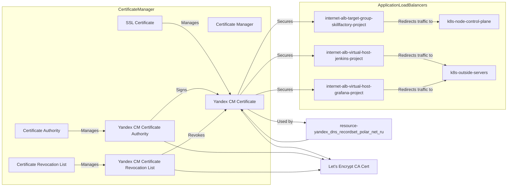
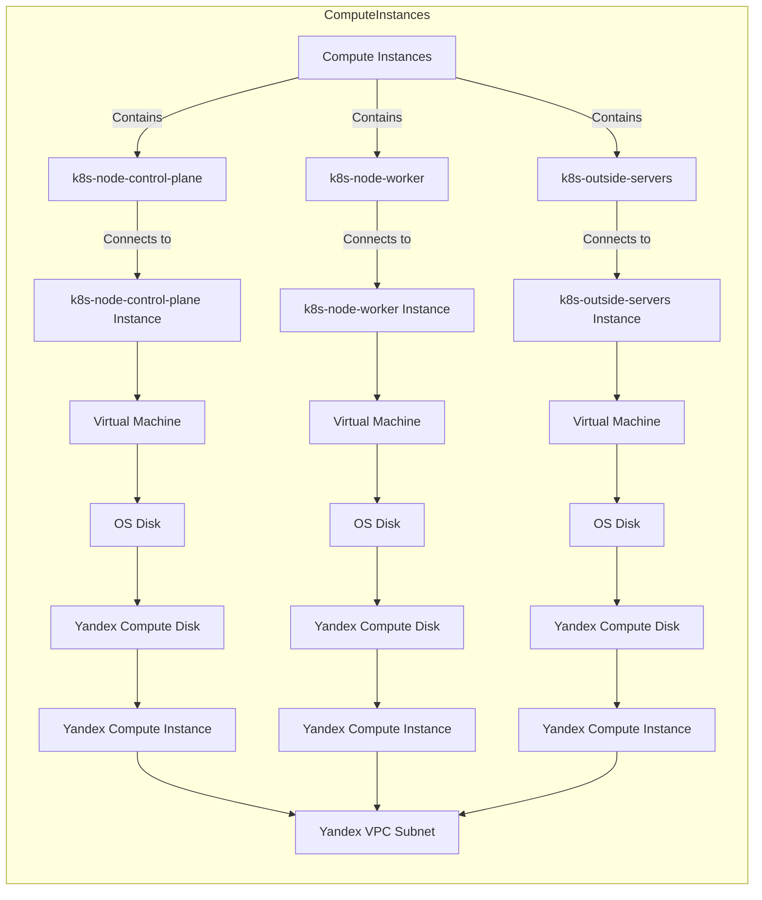
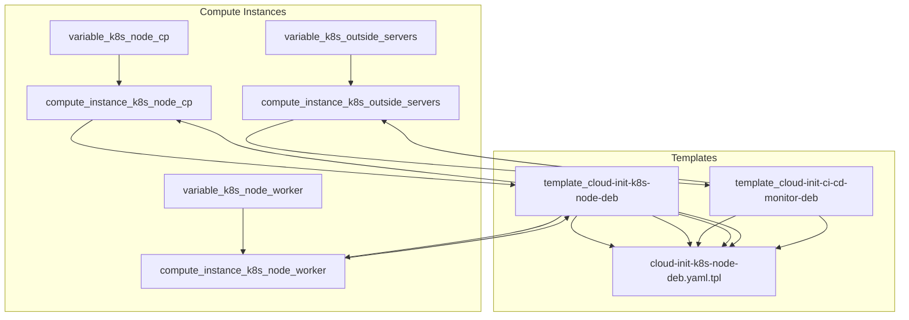
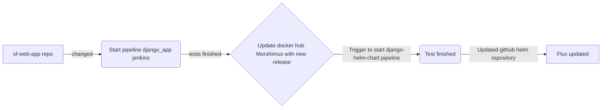

# SkillFactory Diploma Work

* *Ссылки которые связаны с проектом.*

## [Skillfactory Diploma Work Web App](https://github.com/Morshimus/SkillFactory-Diploma-Work-Web-App) - Приложение написанное на framework Django, язык python3

## [Skillfactory Diploma Work CI Role](https://github.com/Morshimus/SkillFactory-Diploma-Work-CI-Role) - Роль Ansible для деплоя CI\CD Jenkins Pipelines

## [Skillfactory Diploma Work Prometheus Stack Role](https://github.com/Morshimus/SkillFactory-Diploma-Work-Loki-Prom-Grafana-Role) - Роль Ansible для деплоя кластера мониторинга Prometheus с Loki и Grafana

## [Skillfactory Diploma Work Helm Charts](https://github.com/Morshimus/SkillFactory-Diploma-Work-Helm-Charts) - Helm шаблон для приложения, плюс модифицированный шаблоны promtail и  postgresql. Работает как helm репозиторий


<details><summary><b>Разделы:</b></summary>

- [0.Схемы Terraform Ифраструктуры](https://github.com/Morshimus/SkillFactory-Diploma-Work#zero-%D1%81%D1%85%D0%B5%D0%BC%D0%B0-virtual-privat-cloud-network)
- [1.Описание Terraform Инфраструктуры](https://github.com/Morshimus/SkillFactory-Diploma-Work#one-%D0%B7%D0%BD%D0%B0%D0%BA%D0%BE%D0%BC%D1%81%D1%82%D0%B2%D0%BE-%D1%81-%D0%B8%D0%BD%D1%84%D1%80%D0%B0%D1%81%D1%82%D1%80%D1%83%D0%BA%D1%82%D1%83%D1%80%D0%BE%D0%B9)
- [2.Описание процесса CI\CD](https://github.com/Morshimus/SkillFactory-Diploma-Work#two-jenkins-%D0%BF%D0%BE%D0%BC%D0%BE%D0%B3%D0%B0%D0%B9-%D1%81%D1%82%D1%80%D0%BE%D0%B8%D0%BC-pipeline-%D0%BD%D0%B0-jenkins-%D0%B2-k8s-cluster)
- [3.Описание Мониторинга](https://github.com/Morshimus/SkillFactory-Diploma-Work#three-%D1%87%D1%82%D0%BE-%D0%BF%D1%80%D0%BE%D1%81%D0%B8%D1%85%D0%BE%D0%B4%D0%B8%D1%82-%D1%81-%D0%BD%D0%B0%D1%88%D0%B8%D0%BC-%D0%B8%D0%BD%D0%B3%D1%80%D0%B5%D1%81-%D0%BA%D0%BE%D0%BD%D1%82%D1%80%D0%BE%D0%BB%D0%BB%D0%B5%D1%80%D0%BE%D0%BC-%D0%BF%D1%80%D0%B8%D0%BB%D0%BE%D0%B6%D0%B5%D0%BD%D0%B8%D0%B5%D0%BC-%D0%B1%D0%B4-%D0%BD%D0%BE%D0%B4%D0%B0%D0%BC%D0%B8-promtheus-%D1%80%D0%B0%D0%B7%D0%B2%D0%BE%D0%B4%D0%B8-%D0%BE%D0%B3%D0%BE%D0%BD%D1%8C---%D0%B7%D0%BE%D0%B2%D0%B8-%D0%BD%D0%B0-%D0%BA%D0%BE%D1%81%D1%82%D1%80%D0%B8%D1%89%D0%B5-loki-%D0%B8-grafana)
- [4.Заключение](https://github.com/Morshimus/SkillFactory-Diploma-Work#four-%D0%B7%D0%B0%D0%BA%D0%BB%D1%8E%D1%87%D0%B5%D0%BD%D0%B8%D0%B5)
- [5.Terraform-docs](https://github.com/Morshimus/SkillFactory-Diploma-Work#five)

</details>


### :zero: Схема Virtual Privat Cloud Network



### Схема DNS



### Схема Application Load Balancers



### Схема Certificate Manager



### Схема Compute Instances



### Схема Local Files

```mermaid

graph TD

    subgraph Local Files
        local_file_ansible_template --> templatefile --> local_file_ansible_inventory_template
        local_file_cloud_init_yaml_tpl --> templatefile --> local_file_cloud_init_yaml_tpl
        local_file_cloud_init_k8s_node_deb_yaml_tpl --> templatefile --> local_file_cloud_init_k8s_node_deb_yaml_tpl
        local_file_cloud_init_ci_cd_monitor_deb_yaml_tpl --> templatefile --> local_file_cloud_init_ci_cd_monitor_deb_yaml_tpl
        local_file_raw_secrets_sf_web_app_template --> templatefile --> local_file_raw_secrets_sf_web_app
        local_file_raw_secrets_infra_template --> templatefile --> local_file_raw_secrets_infra
        local_file_provisioning_yaml_tpl_template --> templatefile --> local_file_provisioning_yaml
        local_file_promtail_release_yaml_tpl --> templatefile --> local_file_promtail_release_yaml
        tls_private_key_key --> local_file_private_key
    end

    subgraph Destination Files
        local_file_raw_secrets_infra --> destination_file_raw_secrets_infra.yaml
        local_file_raw_secrets_sf_web_app --> destination_file_raw_secrets_sf_web_app.yaml
        local_file_promtail_release_yaml --> destination_file_promtail_release.yaml
        local_file_provisioning_yaml --> destination_file_provisioning.yaml
        local_file_ansible_inventory_template --> destination_file_yandex_inventory.ini
        local_file_private_key --> destination_file_SSH_KEY_FINAL
    end



```



### Схема Templates



## :one: Знакомство с инфраструктурой.

> Для выполнения задания был выбран путь динамической шаблонизации почти всего. Инвентаризация, файлы конфигураций секретов kubeseal, ansible playbooks и т.д.


```tpl
[all]
%{ for index, node in k8s_cluster_node_name ~}
${node}  ansible_host=${lookup(k8s_cluster_node_ip, index, 0 )} ansible_user=${user} ansible_become=yes %{ if lookup(etcd_member_name,  index , false) != false }etcd_member_name=etcd${index}%{ else }%{ endif }
%{ endfor ~}

%{ if bastion_member_name != null}
[bastion]
%{ for index, server in external_servers_name.name ~}
%{ if lookup(bastion_member_name ,  index , false) != false }${server} ansible_host=${lookup(external_servers_ip, index, 0)} ansible_user=${user}
%{ else }
%{ endif }
%{ endfor ~}
%{ else }
%{ endif }

[kube-master]
%{ for index, node in k8s_cluster_cp_name ~}
${node}
%{ endfor ~}


[etcd]
%{ for index, node in k8s_cluster_node_name ~}
%{ if lookup(etcd_member_name,  index , false) != false }${node}
%{ else }
%{ endif }
%{ endfor ~}

[kube-node]
%{ for index, node in k8s_cluster_worker_name ~}
${node}
%{ endfor ~}


[calico-rr]

[k8s-cluster:children]
kube-master
kube-node
calico-rr

%{ if monitoring_member_name != null}
[monitoring]
%{ for index, server in external_servers_name ~}
%{ if lookup(monitoring_member_name ,  index , false) != false }${server} ansible_host=${lookup(external_servers_ip, index, 0)} ansible_user=${user} ansible_become=yes
%{ else }
%{ endif }
%{ endfor ~}
%{ else }
%{ endif }

%{ if ci_cd_member_name != null}
[Jenkins-CI]
%{ for index, server in external_servers_name ~}
%{ if lookup(ci_cd_member_name ,  index , false) != false }${server} ansible_host=${lookup(external_servers_ip, index, 0)} ansible_user=${user} ansible_become=yes
%{ else }
%{ endif }
%{ endfor ~}
[Jenkins-CI:vars]
Jenkins_Docker_root=/opt/morsh_ci
%{ else }
%{ endif }

```

> Было решено купить временный домен для дипломного проекта, им стал дешевенький polar.net.ru 3его уровня, но нам хватит более чем. Была проведена делегация домена в Yandex Cloud.


> Из схемы DNS видно что были созданы записи, k8s.polar.net.ru для связи с kube api, все остальные приложения - это ALB


> Создан ресурс CertificateManage c помощью которого автоматически обновляется challange cname в буличной DNS зоне polar.net.ru


*Особеноостью в yandex является то, что terraform пытается пересоздать СM после каждого timestamp измениния. Принуждаем его расслабиться  и игнорировать изменения. Также, ставим таймаут при изменении\создании записи challange - должна пройти валидация, прежде чем сертификат будет выпущен\перевыпущен*

```hcl
resource "yandex_dns_recordset" "polar-net-ru" {
  count   = yandex_cm_certificate.polar-net-ru.managed[0].challenge_count
  zone_id = yandex_dns_zone.dns_pub.id
  name    = yandex_cm_certificate.polar-net-ru.challenges[count.index].dns_name
  type    = yandex_cm_certificate.polar-net-ru.challenges[count.index].dns_type
  data    = [yandex_cm_certificate.polar-net-ru.challenges[count.index].dns_value]
  ttl     = 60

  provisioner "local-exec" {
    command     = "Wait-Event -Timeout 600"
    interpreter = ["powershell.exe", "-NoProfile", "-c"]
  }

}

resource "yandex_cm_certificate" "polar-net-ru" {
  name    = "polar-net-ru"
  domains = ["polar.net.ru", "*.polar.net.ru"]

  managed {
    challenge_type  = "DNS_CNAME"
    challenge_count = 1
  }

  lifecycle {
    ignore_changes = [
      challenges,
      created_at,
      domains,
      folder_id,
      id,
      issued_at,
      issuer,
      labels,
      name,
      status,
      subject,
      type,
      updated_at

    ]
  }
}
```


> В целях безопасности, была применена Security Group к машинам за натом - разрешен только адрес запускающего apply data.http.myip , на ALB не распространяется. В идеале - все делаем через bastion, прописываем туннели для kube api - оставляем адрес только для ALB.


> **ВАЖНО!** Число нод и их назначения задается через переменные Terraform. Самое главное чтобы postfix значения для нод Kubernetes **были разные!!** . иначе возникают проблемы с дупликатами значений map - которые используются в динамических циклах. Значения  postfix для outside server могут пересекаться с node, но не с самими собой.


```hcl
variable "k8s_node_cp" {
  type = object({
    name        = map(string),
    etcd_member = map(bool)
  })
  description = <<-EOT
    Number of control plane nodes in k8s cluster. 
    For name:
      Key - is postfix
      Value - is prefix
    For etcd_member:
      Key - is postfix
      Value - is bool
    EOT
  default = {
    name = {
      "001" = "k8s-cp-polar-"
    },
    etcd_member = {
      "001" = true
    }
  }
}

variable "k8s_node_worker" {
  type = object({
    name        = map(string)
    etcd_member = map(bool)
  })
  description = <<-EOT
    Number of worker nodes in k8s cluster.
    For name:
      Key - is postfix
      Value - is prefix
    For etcd_member:
      Key - is postfix
      Value - is bool
    EOT
  default = {
    name = {
      "002" = "k8s-worker-polar-"
    },
    etcd_member = {
      "002" = false
    }

  }
}

variable "k8s_outside_srv" {
  type = object({
    name       = map(string)
    ci-cd      = map(bool)
    monitoring = map(bool)
    bastion    = map(bool)
  })
  description = <<-EOT
    Number of external servers outside of k8s cluster.
    For name:
      Key - is postfix
      Value - is prefix
    For ci-cd:
      Key - is postfix
      Value - is bool
    For monitoring:
      Key - is postfix
      Value - is bool
    For bastion:
      Key - is postfix
      Value - is bool     
    EOT
  default = {
    name = {
      "003" = "srv-ext-polar-"
    },
    ci-cd = {
      "003" = true
    },
    monitoring = {
      "003" = true
    },
    bastion = {}
  }
}

```

*Функционал multi control-plan node не доделан - нужен NLB для этого. Все остальное функционирует. Было решено опустить эту часть - так как она не является требуемой в задании Дипломного проекта. Тоесть - да по сути мы можем сделать DOCKER SWARM из 2ух серверов вместо 1 внешнего.*

> Внедрена преднастройка и обновление образов систем через cloud-init - посредством шаблонизации и передачи в модуль. Terraform ожидает успешного завершения процедур обновления и настройки систем, выполнено ожидание путем remote-exec cloud-init status --wait

```hcl
  provisioner "remote-exec" {
    inline = [
      "cloud-init status --wait"
    ]
    connection {
      type        = "ssh"
      user        = var.useros
      private_key = var.adm_prv_key
      host        = self.network_interface[count.index].nat_ip_address
    }
  }
```

```yaml
#cloud-config
users:
  - name: ${useros}
    groups: sudo
    shell: /bin/bash
    sudo: ['ALL=(ALL) NOPASSWD:ALL']
    ssh-authorized-keys:
      - ${adm_pub_key}
package_update: true
package_upgrade: true
packages:
  # Update the apt package index and install packages needed to use the Docker and Kubernetes apt repositories over HTTPS
  - apt-transport-https
  - ca-certificates
  - curl
  - gnupg
  - lsb-release
  - snap
  - containerd

power_state:
 delay: "+1"
 mode: reboot
 message: Reboot
 timeout: 1
 condition: True
```
*В конец машины перезагружаются.*

> После окончания шаблонизирования и cloud-init конфигов - на сцену выходить ansible при создании файла inventory, для настройки наших хостов monitoring и CI\CD - у нас это 1 хост - но возможно масштабирование - модули сделаны на новый лад и поддерживают for_each. 

```yaml
---
- hosts: Jenkins-CI
  gather_facts: yes
  become: yes   
  roles:
    - role: Jenkins
      vars:
        jenkins_package_version: "1.2.0"
      
- hosts: monitoring
  gather_facts: yes
  become: yes
  roles:
     - role: Prometheus
       vars:
         node_exporter_targets:
          - nodeexporter:9100
          - k8s-cp-polar-001.polar.grp:30091
          - k8s-worker-polar-002.polar.grp:30091
         cadvisor_exporter_targets:
          - cadvisor:8080
          - k8s-cp-polar-001.polar.grp:9080
          - k8s-worker-polar-002.polar.grp:9080
         nginx_exporter_targets:
          - k8s-cp-polar-001.polar.grp:10254
          - k8s-worker-polar-002.polar.grp:10254
         postgresql_exporter_targets:
          - k8s-cp-polar-001.polar.grp:9187
         Prometheus_Docker_root: /opt/morsh_monit
         prometheus_package_version: "1.2.0"
```

*Прошу заметить что значения динамические. И меняются в зависимости от количества нод*

```tpl
---
- hosts: Jenkins-CI
  gather_facts: yes
  become: yes   
  roles:
    - role: Jenkins
      vars:
        jenkins_package_version: "1.2.0"
      
- hosts: monitoring
  gather_facts: yes
  become: yes
  roles:
     - role: Prometheus
       vars:
         node_exporter_targets:
          - nodeexporter:9100
%{ for index, node in k8s_cluster_node_name ~}
          - ${node}:30091
%{ endfor ~}
         cadvisor_exporter_targets:
          - cadvisor:8080
%{ for index, node in k8s_cluster_node_name ~}
          - ${node}:9080
%{ endfor ~}
         nginx_exporter_targets:
%{ for index, node in k8s_cluster_node_name ~}
          - ${node}:10254
%{ endfor ~}
         postgresql_exporter_targets:
%{ for index, node in k8s_cluster_cp_name ~}
          - ${node}:9187
%{ endfor ~}
         Prometheus_Docker_root: /opt/morsh_monit
         prometheus_package_version: "1.2.0"
```

> Теперь черед kubesrpay. Самый главный аттрибут который нам пригодится - override_system_hostname: false   - так как мы уже назначили имена нашим нодам. Выполняется в моем случае из docker контейнера - время от 30 до 40 минут.

```ini

[all]
k8s-cp-polar-001.polar.grp  ansible_host=51.250.6.184 ansible_user=morsh-adm ansible_become=yes etcd_member_name=etcd001
k8s-worker-polar-002.polar.grp  ansible_host=158.160.106.116 ansible_user=morsh-adm ansible_become=yes 


[kube-master]
k8s-cp-polar-001.polar.grp


[etcd]
k8s-cp-polar-001.polar.grp


[kube-node]
k8s-worker-polar-002.polar.grp


[calico-rr]

[k8s-cluster:children]
kube-master
kube-node
calico-rr


[monitoring]
srv-ext-polar-003.polar.grp ansible_host=158.160.105.38 ansible_user=morsh-adm ansible_become=yes


[Jenkins-CI]
srv-ext-polar-003.polar.grp ansible_host=158.160.105.38 ansible_user=morsh-adm ansible_become=yes

[Jenkins-CI:vars]
Jenkins_Docker_root=/opt/morsh_ci


```

> И мы подходим к самому вкусному. Flux -  запускаем его и ждем инициализации.И далее Завершаем наш парад kubeseal - ждем пока создастся service sealed-secrets , иначе выполнение не будет успешным. Прилагаю скрипт всего действа, функции из actions.ps1 файла.

```hcl
resource "local_file" "yandex_inventory" {
  content  = local.ansible_template
  filename = "${path.module}/inventory/sf-cluster/inventory.ini"

  provisioner "local-exec" {
    command     = <<EOF
     Wait-Event -Timeout 120;
     wsl -e /bin/bash -c 'cp .vault_pass_diploma  ~/.vault_pass_diploma ; chmod 0600 ~/.vault_pass_diploma'; ## Настраиваем секреты ansible-vault
     wsl -e /bin/bash -c 'cp SSH_KEY_FINAL  ~/.ssh/SSH_KEY_FINAL ; chmod 0600 ~/.ssh/SSH_KEY_FINAL'; ## Настраиваем ssh приватный ключ - который тоже динамический.
     . ./actions.ps1; ## Запускаем наш wrapper который  - переменные среды указаны ниже и взяты из загифрованного secrets.yml.
     UpdateAnsibleRoles; ## обновляем роли через ansible-galaxy из наших репозиториев, которые указаны  в самом начале этого проекта.
     ansible-playbook -secret;  ## Устанавлиаем роли с помощью динаического плейбука provisioning.yaml
     kubespray; ## Запускаем kubespray - монтируем директорию inventory\sf-cluster
     $ConnectionConf= gc $env:KUBECONFIG; 
     $ConnectionConf=$ConnectionConf  -replace "${lookup(local.k8s_cluster_cp_ip_priv, "ip", 0)}", "${lookup(local.k8s_cluster_cp_ip_pub, "ip", 0)}";
     $ConnectionConf | Set-Content -Encoding UTF8 $env:KUBECONFIG;  ## Производим модификацию адреса подключения kube api на внешний адрес.
     flux_bootstrap; ## Инициализируем flux в clusters\sf-cluster\flux-system. После выполнения сразу же начинается kustomization инфраструктуры кубера - далее приложения.
     do{k --insecure-skip-tls-verify  get svc  sealed-secrets -n kube-system }while( $? -like $false); ## Ждем поднятия сервиса sealed-secrets, чтобы сгенерировать зашифрованные секреты.
     kubeseal_refresh ## После успешной генерации секретов, делается коммит, и push - Все, они уже во Flux, под надзором Kusтомизатора.
    EOF
    interpreter = ["powershell.exe", "-NoProfile", "-c"]

    environment = {
      GITHUB_TOKEN = data.ansiblevault_path.github-token.value
      GITHUB_USER  = data.ansiblevault_path.github-user.value
    }
  }
}
```

> Ниже приведу функции kubeseal из actions.ps1, и также создание сырых(незашифрованных) секретов из темплейтов (которые в gitignore).  Kubeseal применяется при изменении паролей в незашифрованных секретах (также если сервис существует, если нет, ожидает общего конфига) - но лучше этого не делать на рабочем кластере, либо делать по-умному - мы плавно переходим к helm и ci cd части.

```ps1
function kubeseal_resource {
    Param ( 
     [Parameter(Mandatory=$true, Position=0)]
     [string]$secretfile,
     [Parameter(Mandatory=$false, Position=0)]
     [string]$destination
     )
  
    Get-content $secretfile | kubeseal --insecure-skip-tls-verify  --controller-name=sealed-secrets --controller-namespace=kube-system --format yaml > $destination\sealed-secrets.yaml; if($?){

    git add .;
    git commit -am "Updated sealed secrets at  $destination" ;
    git push

    }
}

function kubeseal_refresh {
    kubeseal_resource -secretfile .\raw_secrets_infra.yaml  -destination "$((Get-Location).Path)\apps\sf-cluster\postgresql" | Out-Null;
    kubeseal_resource -secretfile .\raw_secrets_sf_web_app.yaml  -destination "$((Get-Location).Path)\apps\sf-cluster\sf-web"| Out-Null;
}
```

> terraform код для сырых секретов

```hcl
resource "local_file" "raw_secrets_infra" {
  content  = local.raw_secrets_infra_template
  filename = "${path.module}/raw_secrets_infra.yaml"

  provisioner "local-exec" {
    command     = <<EOF
     . ./actions.ps1;
     if($(k --insecure-skip-tls-verify get svc  sealed-secrets -n kube-system)){kubeseal_resource -secretfile ./raw_secrets_infra.yaml  -destination './apps/sf-cluster/postgresql' | Out-Null;}
    EOF
    interpreter = ["powershell.exe", "-NoProfile", "-c"]
    environment = {
      GITHUB_TOKEN = data.ansiblevault_path.github-token.value
      GITHUB_USER  = data.ansiblevault_path.github-user.value
    }
  }
}

resource "local_file" "raw_secrets_sf_web_app" {
  content  = local.raw_secrets_sf_web_app_template
  filename = "${path.module}/raw_secrets_sf_web_app.yaml"

  provisioner "local-exec" {
    command     = <<EOF
     . ./actions.ps1;
     if($(k --insecure-skip-tls-verify get svc  sealed-secrets -n kube-system)){kubeseal_resource -secretfile ./raw_secrets_sf_web_app.yaml  -destination "./apps/sf-cluster/sf-web" | Out-Null;}
    EOF
    interpreter = ["powershell.exe", "-NoProfile", "-c"]
    environment = {
      GITHUB_TOKEN = data.ansiblevault_path.github-token.value
      GITHUB_USER  = data.ansiblevault_path.github-user.value
    }
  }
}
```

## :two: Jenkins, помогай. Строим Pipeline на Jenkins в K8S cluster.

> И вот мы плавно переходим к настройке нашего конвеера. Jenkins был выбран не в силу каких либо убеждений - а в силу того что был при обучении проект который так и просился стать CD в кубер. Агенты настроены с образом dind -  поэтому ограничение автоматизации - только наша фантазия. Имеем 2 агента:

*Второй агент будет поднимать k8s кластер на kind. Поэтому дадим ему ресурсов..*

```yaml

x-agent-1-cpu: &Agent_1_CPU "${DOCKER_agent_1_CPUS:-1}"
x-agent-1-mem: &Agent_1_MEM "${DOCKER_agent_1_MEMORY:-512MB}"
x-agent-2-cpu: &Agent_2_CPU "${DOCKER_agent_2_CPUS:-2}"
x-agent-2-mem: &Agent_2_MEM "${DOCKER_agent_2_MEMORY:-1536MB}"

```

*Наш адрес.Ментор - можно зайти на логин page.*

### https://jenkins.polar.net.ru


> Давайте рассмотрим наши конвееры, что мы делаем в каждом конкретном случае. И начнем с самого первого и основного..

### django_app

> Создан для сборки приложения на Django (ссылка дана выше). Trigger -  push действия в репозиторий - новые коммиты. Для ведения подробной версионности реализован shell  запрос к API docker hub репозитория (моего личного).

```shell

export latest=$(curl https://hub.docker.com/v2/repositories/morsh92/skillfactory-web-pg/tags?page_size=2 -H "Accept: application/json" | jq .[] | jq .[] | jq -r .name | awk "END{print}" );export add=0.1;export new_version=$(echo  "${latest}+${add}" | bc -l)

```
> Скрипт берет последнюю версю tag, и добавляет к ней 0.1 - нам это понадобиться в дальнейшем, чтобы безопасно организовать СD в кубер. Далее выполняется docker push. Pipline на groovy выглядит так:

```groovy
pipeline {
    agent {
       node{
          label 'agent-primary'
        }    
    }
    stages {
        stage('Preparation') { // for display purposes
            steps {
                git branch: 'main', url:'https://github.com/Morshimus/SkillFactory-Diploma-Work-Web-App.git'
                sh 'apk update && apk add ansible curl jq'
                sh 'cd /tmp && ansible-playbook provision.yaml'
            }
        }
        stage('Build') {
            steps {
                sh 'export latest=$(curl https://hub.docker.com/v2/repositories/morsh92/skillfactory-web-pg/tags?page_size=2 -H "Accept: application/json" | jq .[] | jq .[] | jq -r .name | awk "END{print}" );export add=0.1;export new_version=$(echo  "${latest}+${add}" | bc -l);docker build -t morsh92/skillfactory-web-pg:latest -t morsh92/skillfactory-web-pg:$new_version .'
            }
        }
        stage('Test'){
            steps {
                sh 'docker rm django-tst -f'
                sh 'docker run --rm --name django-tst -e DJANGO_DB_NAME=django_test -e DJANGO_DB_USER=django -e DJANGO_DB_PASSWORD=test123 -e DJANGO_DB_HOST=172.17.0.1 -e DJANGO_DB_PORT=5432 -p 8000:8000 -d morsh92/skillfactory-web-pg:latest'
                sh 'sleep 30 && wget http://localhost:8000/admin && rm admin'
                sh 'docker rm django-tst -f'
            }    
        }
        stage('Release') {
            steps {
            withCredentials([usernamePassword(credentialsId: 'docker-hub', passwordVariable: 'dockerpwd', usernameVariable: 'dockerusr')]) {
                    sh "docker login -u ${dockerusr} -p ${dockerpwd}"
                    sh "docker push morsh92/skillfactory-web-pg:latest"
                    sh 'export latest=$(curl https://hub.docker.com/v2/repositories/morsh92/skillfactory-web-pg/tags?page_size=2 -H "Accept: application/json" | jq .[] | jq .[] | jq -r .name | awk "END{print}" );export add=0.1;export new_version=$(echo  "${latest}+${add}" | bc -l);docker push morsh92/skillfactory-web-pg:$new_version'
                    sh "docker logout && rm /home/jenkins/.docker/config.json"
                    sh "docker system prune -af"
                }
            }
        }
    }
    post {
        success {
            withCredentials([string(credentialsId: 'jenkins_polar_bot', variable: 'TOKEN'), string(credentialsId: 'chatWebid', variable: 'CHAT_ID')]) {
                sh  ("""
                curl -s -X POST https://api.telegram.org/bot${TOKEN}/sendMessage -d chat_id=${CHAT_ID} -d parse_mode=markdown -d text='\u2705 *${env.JOB_NAME}* : POC *Branch*: ${env.GIT_BRANCH} *Build* : OK *Published* = YES'
                """)
            }
        }

        aborted {
            withCredentials([string(credentialsId: 'jenkins_polar_bot', variable: 'TOKEN'), string(credentialsId: 'chatWebid', variable: 'CHAT_ID')]) {
                sh  ("""
                curl -s -X POST https://api.telegram.org/bot${TOKEN}/sendMessage -d chat_id=${CHAT_ID} -d parse_mode=markdown -d text='\u26a0\ufe0f *${env.JOB_NAME}* : POC *Branch*: ${env.GIT_BRANCH} *Build* : `Aborted` *Published* = `Aborted`'
                """)
           }
        }
     
        failure {
            withCredentials([string(credentialsId: 'jenkins_polar_bot', variable: 'TOKEN'), string(credentialsId: 'chatWebid', variable: 'CHAT_ID')]) {
                sh  ("""
                curl -s -X POST https://api.telegram.org/bot${TOKEN}/sendMessage -d chat_id=${CHAT_ID} -d parse_mode=markdown -d text='\u274c *${env.JOB_NAME}* : POC  *Branch*: ${env.GIT_BRANCH} *Build* : `not OK` *Published* = `no`'
                """)
            }
        }

    }
}

```

> Ну конечно же куда без оповещений...Настроен телеграм бот.


### django-helm-chart

> И бесспорно самая интересная для меня часть этого проекта - мы делаем свой Helm чарт. Но придеться начать издалека..Давайте поймем как будет осуществляться автоматическая доставка нашего чарта.

**Flux спешит на помощь**

Release:

```yaml
apiVersion: helm.toolkit.fluxcd.io/v2beta1
kind: HelmRelease
metadata:
  name: sf-web-app
  namespace: sf-web-app
spec:
  releaseName: sf-web-app
  chart:
    spec:
      chart: sf-web-app
      sourceRef:
        kind: HelmRepository
        name: sf-web-app
        namespace: sf-web-app
  interval: 1m
  install:
    remediation:
      retries: 3
  values:
    db_name: 'django'
    db_host: 'postgresql.postgresql.svc.cluster.local'
    db_port: '"5432"'
    ingress:
      enabled: true
      annotations: 
        kubernetes.io/ingress.class: nginx
      hosts:
        - host: skillfactory.polar.net.ru
          paths:
           - path: /
             pathType: ImplementationSpecific
    autoscaling:
      enabled: true
      minReplicas: 2
      maxReplicas: 4
      targetCPUUtilizationPercentage: 50
      targetMemoryUtilizationPercentage: 60
    resources:
      limits:
        memory: 200Mi
        cpu: 100m
         
```
*По умолчанию мистер Flux, реагирует на изменение версии нашего чарта. Видя что в репозитории появилась новая версия, он немедленно начнет его reconcillation, а потом и апдейт helmrelease объекта.*

> Поговорим о репозитории. Для helm мы сделаем свой Helm репозиторий, используя функционал Github pages, и автоматизируем его обновление. Помимо нашего приложения в репозитории будут еще необходимые элементы - postgresql и pormtail  - но их оставим за мануальным обновлением и правкой ( порой источники на bitnami данных релизов недоступны - блокировка, а версии бывают сломаны). Ссылка на Github в начале проекта.

Repository:

```yaml
apiVersion: source.toolkit.fluxcd.io/v1beta2
kind: HelmRepository
metadata:
  name: sf-web-app
  namespace: sf-web-app
spec:
  interval: 1m
  url: https://morshimus.github.io/SkillFactory-Diploma-Work-Helm-Charts/
```

*Добавим наш новый ребозиторий во Flux*

> Теперь необходимо сделать конвеер который бы тестировал MVP нашего приложения и проводил smoke тесты - Для этого как нельзя кстати подошел kind.
 - Создаем дефолтный кластер
 - Устанавливаем postgresql с тестовыми данными - необходим для корректной работы проекта sf-web-app
 - Делаем helm lint sf-web-app
 - Делаем helm install -f values-test.yaml  - используем тестовые значения
 - Ждем установки, делаем helm test - проверяем работоспособность


```helm
apiVersion: v1
kind: Pod
metadata:
  name: "{{ include "sf-web-app.fullname" . }}-test-connection"
  labels:
    {{- include "sf-web-app.labels" . | nindent 4 }}
  annotations:
    "helm.sh/hook": test
spec:
  containers:
    - name: wget
      image: busybox
      command: ['wget']
      args: ['{{ include "sf-web-app.fullname" . }}:{{ .Values.service.port }}/admin/']
  restartPolicy: Never
```

 - Упаковываем, обновляем index.yaml и отправляем в наш Git.

> Pipeline на groovy выглядит так

```groovy
pipeline {
    agent {
       node{
          label 'agent-secondary'
        }    
    }
    stages {
        stage('Preparation') { // for display purposes
            steps {
                sh 'apk update && apk add curl jq'
                sh 'curl -LO "https://dl.k8s.io/release/$(curl -L -s https://dl.k8s.io/release/stable.txt)/bin/linux/amd64/kubectl"'
                sh 'chmod +x kubectl'
                sh 'mv kubectl /bin/kubectl'
                sh '[ $(uname -m) = x86_64 ] && curl -Lo ./kind https://kind.sigs.k8s.io/dl/v0.20.0/kind-linux-amd64'
                sh 'chmod +x ./kind'
                sh 'mv ./kind /usr/local/bin/kind'
                sh 'curl -fsSL -o get_helm.sh https://raw.githubusercontent.com/helm/helm/main/scripts/get-helm-3'
                sh 'chmod 700 get_helm.sh'
                sh './get_helm.sh && rm ./get_helm.sh'
                git branch: 'main', url:'https://github.com/Morshimus/SkillFactory-Diploma-Work-Helm-Charts.git'
            }
        }
        stage('Test') {
            steps {
                sh 'kind delete cluster'
                sh 'kind create cluster'
                sh 'cd sf-web-app && sh ./new_app_version.sh'
                sh 'helm install --set auth.database=django --set auth.username=admin --set auth.password=test123  my-release oci://registry-1.docker.io/bitnamicharts/postgresql && sleep 30'
                sh 'cd sf-web-app && helm lint -f values-test.yaml'
                sh 'cd sf-web-app  && helm install test-sf-web -f values-test.yaml . && sleep 60 && helm test test-sf-web  '
                sh 'kind delete cluster'
            }
        }
        stage('Release'){
            steps {
                sh 'git config --global user.email "morsh110792@yahoo.com"'
                sh 'git config --global user.name "Daniel"'
                sh 'cd sf-web-app && sh ./release.sh'
                sh 'rm -f ./sf-web-app-*tgz'
                sh 'helm package ./sf-web-app/'
                sh 'helm package ./postgresql/'
                sh 'helm package ./promtail/'
                sh '[ -f ./index.yaml ] ||  helm repo index --url https://morshimus.github.io/SkillFactory-Diploma-Work-Helm-Charts .  ; [ -f ./index.yaml ] &&  helm repo index --url https://morshimus.github.io/SkillFactory-Diploma-Work-Helm-Charts --merge index.yaml .  '
                sh 'git add .'
                sh 'git commit -am "Updated new release $(git rev-parse --short HEAD)"'
            withCredentials([gitUsernamePassword(credentialsId: 'git-deployer-id', gitToolName: 'git-tool')]){
                sh 'git push --set-upstream origin main'
            }
                sh "docker system prune -af"
            }    
        }
    }
    
    post {
        success {
            withCredentials([string(credentialsId: 'jenkins_polar_bot', variable: 'TOKEN'), string(credentialsId: 'chatWebid', variable: 'CHAT_ID')]) {
                sh  ("""
                curl -s -X POST https://api.telegram.org/bot${TOKEN}/sendMessage -d chat_id=${CHAT_ID} -d parse_mode=markdown -d text='\u2705 *${env.JOB_NAME}* : POC *Branch*: ${env.GIT_BRANCH} *Build* : OK *Published* = YES'
                """)
            }
        }

        aborted {
            withCredentials([string(credentialsId: 'jenkins_polar_bot', variable: 'TOKEN'), string(credentialsId: 'chatWebid', variable: 'CHAT_ID')]) {
                sh  ("""
                curl -s -X POST https://api.telegram.org/bot${TOKEN}/sendMessage -d chat_id=${CHAT_ID} -d parse_mode=markdown -d text='\u26a0\ufe0f *${env.JOB_NAME}* : POC *Branch*: ${env.GIT_BRANCH} *Build* : `Aborted` *Published* = `Aborted`'
                """)
           }
        }
     
        failure {
            withCredentials([string(credentialsId: 'jenkins_polar_bot', variable: 'TOKEN'), string(credentialsId: 'chatWebid', variable: 'CHAT_ID')]) {
                sh  ("""
                curl -s -X POST https://api.telegram.org/bot${TOKEN}/sendMessage -d chat_id=${CHAT_ID} -d parse_mode=markdown -d text='\u274c *${env.JOB_NAME}* : POC  *Branch*: ${env.GIT_BRANCH} *Build* : `not OK` *Published* = `no`'
                """)
            }
        }

    }
}
```

> Не забываем добавить во Flux зависимость sf-web-app от postgresql.

```yaml

apiVersion: kustomize.toolkit.fluxcd.io/v1
kind: Kustomization
metadata:
  name: app-sf-web
  namespace: flux-system
spec:
  interval: 1m0s
  dependsOn:
    - name: infra-controllers
    - name: postgresql
  sourceRef:
    kind: GitRepository
    name: flux-system
  path: ./apps/sf-cluster/sf-web
  prune: true
  suspend: false
  wait: true
  timeout: 1m0s

```

> Вернемся к секретам - почему нельзя менять данные базы на уже созданном релизе? Потому что postgresql helm устанавливается путем Statefulset с привязкой к существующей pvc, которую создает flux через Kustomization - Наше хранилище имеет определенный путь и при перезатерании паролей, данные на конечном PersistentVolume и StorageClass - не изменятся! Если нужно это сделать и избежать проблем - лучше удалить из Kustomization  postgresql, изменить путь хранилища в PV(старое если нужно, можно удалить ручками на ноде), смeнить секреты через kubeseal - добавить postgresql в Kustomization. Это приведет к простою - поэтому заранее нужно планировать Maintenance часы. Данный кейс не касатся деплоя с 0.

> Нарисуем схему.



> Мы не делаем триггера на отслеживание репозитория helm - так как получится бесконечная петля. Вместо этого helm pipeline следит за успешным выполенинем django_app. По сути мы реализовали Werf.


> Также не забываем назначить расписание на периодическую сборку нашего приложения, для поддержания актуальности.


> При планировании архитектуры Flux, был использован пример - https://github.com/fluxcd/flux2-kustomize-helm-example. Flux tree будет выглядеть так:

```tree
SkillFactory-Diploma-Work
├── apps
│   └── sf-cluster
│       ├── cadvisor
│       │   ├── kustomization.yaml
│       │   ├── namespace.yaml
│       │   ├── release.yaml
│       │   └── repository.yaml
│       ├── postgresql
│       │   ├── kustomization.yaml
│       │   ├── namespace.yaml
│       │   ├── persistentvolume.yaml
│       │   ├── persistentvolumeclaims.yaml
│       │   ├── release.yaml
│       │   ├── repository.yaml
│       │   ├── sealed-secrets.yaml
│       │   └── storageclass.yaml
│       ├── prometheus-node-exporter
│       │   ├── kustomization.yaml
│       │   ├── namespace.yaml
│       │   ├── release.yaml
│       │   └── repository.yaml
│       ├── promtail
│       │   ├── kustomization.yaml
│       │   ├── namespace.yaml
│       │   ├── release.yaml
│       │   └── repository.yaml
│       └── sf-web
│           ├── kustomization.yaml
│           ├── namespace.yaml
│           ├── release.yaml
│           ├── repository.yaml
│           └── sealed-secrets.yaml
├── infra
│   └── sf-cluster
│       └── controllers
│           ├── ingress-nginx.yaml
│           ├── kustomization.yaml
│           ├── metric-server.yaml
│           └── sealed-server.yaml
├── clusters
│   └── sf-cluster
│       ├── apps.yaml
│       ├── flux-system
│       │   ├── gotk-components.yaml
│       │   ├── gotk-sync.yaml
│       │   └── kustomization.yaml
│       └── infra.yaml

```

> Для helm установки приложения был выбран путь hpa - Horizontal Pod Autoscaler. Также был настроен ingress nginx порт 80 - skillfactory.polar.net.ru. Пароль берется из Secrets которые управляются sealed. Для всего этого были подняты контроллера в разделе Infra, все Kustomization в apps.yaml в зависимости от infra-controllers - которая описана в infra.yaml в clusters/sf-cluster. 

```shell
NAME         REFERENCE               TARGETS            MINPODS   MAXPODS   REPLICAS   AGE
sf-web-app   Deployment/sf-web-app   32%/60%, 10%/50%   2         4         2          2d18h
```

```ps1
PS> k --insecure-skip-tls-verify get sealedsecrets -n sf-web-app
NAME              AGE
sf-web-app-auth   3d15h
```

```shell
  Template:
    Metadata:
      Creation Timestamp:  <nil>
      Labels:
        app.kubernetes.io/managed-by:      Helm
        helm.toolkit.fluxcd.io/name:       sf-web-app
        helm.toolkit.fluxcd.io/namespace:  sf-web-app
      Name:                                sf-web-app-auth # назначение, имя конечного расшифрованного секрета
      Namespace:                           sf-web-app
    Type:                                  Opaque
```

```yaml
values:
    db_name: 'django' # Имя базы данных
    db_host: 'postgresql.postgresql.svc.cluster.local' # Имя локального сервиса postgresql
    db_port: '"5432"' # Порт postgresql
    ingress: # ингресс для нашего сайта
      enabled: true
      annotations: 
        kubernetes.io/ingress.class: nginx
      hosts:
        - host: skillfactory.polar.net.ru
          paths:
           - path: /
             pathType: ImplementationSpecific
    autoscaling: # hpa настройки
      enabled: true
      minReplicas: 2
      maxReplicas: 4
      targetCPUUtilizationPercentage: 50
      targetMemoryUtilizationPercentage: 60
    resources: # лимиты 
      limits:
        memory: 200Mi
        cpu: 100m
         
```

> И конечно же настраиваем ALB для нашего приложения.

```hcl
module "internet-alb-backend-skillfactory-project" {

  source = "git::https://github.com/Morshimus/Terraform-Yandex-Cloud-Application-Load-Balancer-Backend-Group-Module?ref=tags/1.1.3"

  name        = "skillfactory"
  description = "Web site created for Diplom work"
  group       = "app"

  http_backend = [{
    name             = "sf-web-app"
    port             = 80
    weight           = 1
    http2            = false
    target_group_ids = [module.internet-alb-target-group-skillfactory-project.id]
    load_balancing_config = [{
      panic_threshold                = 50
      locality_aware_routing_percent = 20
      strict_locality                = false
      mode                           = "ROUND_ROBIN"
    }]
  }]
}
module "internet-alb-target-group-skillfactory-project" {

  source = "git::https://github.com/Morshimus/Terraform-Yandex-Cloud-Application-Load-Balancer-Target-Group-Module?ref=tags/1.1.1"

  name        = "skillfactory"
  description = "app"
  group       = "application"

  target = [
    for s in keys(local.k8s_cluster_node_ip_priv) :
    merge({ "ip_address" = lookup(local.k8s_cluster_node_ip_priv, s, "10.0.0.1") }, { "subnet_id" = yandex_vpc_subnet.morsh-subnet-a.id })
  ]

}
module "internet-alb-virtual-host-skillfactory-project" {

  source = "git::https://github.com/Morshimus/Terraform-Yandex-Cloud-Application-Load-Balancer-Virtual-Host-Module?ref=tags/1.0.0"

  name           = "skillfactory"
  authority      = ["skillfactory.polar.net.ru"]
  http_router_id = module.internet-alb-http-router-project.id

  route = [{
    name = "sf-web-app"
    http_route = [{
      http_match = []
      http_route_action = [{
        backend_group_id  = module.internet-alb-backend-skillfactory-project.id
        timeout           = "60s"
        host_rewrite      = null
        auto_host_rewrite = null
        prefix_rewrite    = null
        upgrade_types     = []
        idle_timeout      = null
      }]
      redirect_action        = []
      direct_response_action = []
    }]
    grpc_route = []
  }]
}
```


### Пожинаем плоды - наше приложение https://skillfactory.polar.net.ru/polls


## :three: Что просиходит с нашим ингрес контроллером? приложением? бд? нодами?... Promtheus разводи огонь - зови на кострище Loki и Grafana.

> В первой главе мы затронули отчасти настройку Prometheus stack но в детали не вникали. Давайте же познакомимся с ними.

### Привет Grafana https://grafana.polar.net.ru


> Но прежде чем мы будем погружаться в подготовленные dashboards, давайте начнем сначала. Роль устанавливает кластер посредством docker-compose. Наружу хостовой системы иммет доступ только 1 сервис - alermanagent_bot остальные будут использовать прокси caddy:

```Caddyfile
:3000 {
    reverse_proxy grafana:3000  
}

:3100 {
    reverse_proxy loki:3100  
}

:8080 {
    basicauth  {
        {$ADMIN_USER} {$ADMIN_PASSWORD_HASH}
    }    
    reverse_proxy cadvisor:8080
}

:9090 {
    basicauth  {
        {$ADMIN_USER} {$ADMIN_PASSWORD_HASH}
    }
    reverse_proxy prometheus:9090
}

:9093 {
    basicauth  {
        {$ADMIN_USER} {$ADMIN_PASSWORD_HASH}
    }
    reverse_proxy alertmanager:9093
}

:9091 {
    basicauth  {
        {$ADMIN_USER} {$ADMIN_PASSWORD_HASH}
    }    
    reverse_proxy pushgateway:9091
}

:9115 {
    basicauth  {
        {$ADMIN_USER} {$ADMIN_PASSWORD_HASH}
    }    
    reverse_proxy blackbox-exporter:9115
}
```
```yaml
  caddy:
    image: caddy:2.6.4
    container_name: caddy
    ports:
      - "3000:3000"
      - "3100:3100"
      - "9080:8080"
      - "9090:9090"
      - "9093:9093"
      - "9091:9091"
      - "9115:9115"
    volumes:
      - ./PrometheusStack/caddy:/etc/caddy
    environment: *Admin_ENV
    restart: unless-stopped
    networks:
      - monitor-net
    logging: *logging
    labels:
      org.label-schema.group: "monitoring"
    deploy:  
      resources: *resources_common
```

> У Grafana и Loki не делаем авторизацию - Loki и так будет принимать конфиги только из приватной сети, а Графана имеет свою авторизацию.

> Как было сказано ранее по шаблону в роли был создан scrape конфиг из темплейта jinja2:

```jinja2
global:
  scrape_interval:     15s
  evaluation_interval: 15s

  # Attach these labels to any time series or alerts when communicating with
  # external systems (federation, remote storage, Alertmanager).
  external_labels:
      monitor: 'k8s-project'

rule_files:
  - "alert.rules"

scrape_configs:
  - job_name: 'nodeexporter'
    scrape_interval: 5s
    static_configs:
      - targets: 
      
          - {{ item }}
      

  - job_name: 'cadvisor'
    scrape_interval: 5s
    static_configs:
      - targets: 
      
          - {{ item }}
      


  - job_name: 'prometheus'
    scrape_interval: 10s
    static_configs:
      - targets: ['localhost:9090']

  - job_name: 'nginx exporter'
    scrape_interval: 5s
    static_configs:
      - targets: 
      
          - {{ item }}
      
           

  - job_name: 'postgres_exporter'
    scrape_interval: 50s
    static_configs:
      - targets:
      
          - {{ item }}
      


  - job_name: 'django_exporter'
    scrape_interval: 10s
    scheme: https
    static_configs:
      - targets: 
      
          - {{ item }}
      


  - job_name: 'pushgateway'
    scrape_interval: 10s
    honor_labels: true
    static_configs:
      - targets: 
      
          - {{ item }}
      

  - job_name: blackbox
    metrics_path: /probe
    params:
      module: [http_2xx]
    static_configs:
      - targets: 
      
      
          - {{ item }}
      

    relabel_configs:
      - source_labels: [__address__]
        target_label: __param_target
      - source_labels: [__param_target]
        target_label: instance
      - target_label: __address__
        replacement: blackbox-exporter:9115

alerting:
  alertmanagers:
  - scheme: http
    static_configs:
    - targets:
      
          - {{ item }}
      


```

> Конфигурации dashboards и прочие статические настройки были заархиварованы и добавлены в Release на соотвуствующей роли gihub странице.


> Loki Datasource был статически добавлен в этот же архив в раздел Grafana.

```yaml
apiVersion: 1

datasources:
  - name: Prometheus
    type: prometheus
    access: proxy
    orgId: 1
    url: http://prometheus:9090
    basicAuth: false
    isDefault: true
    editable: true

  - name: Loki
    type: loki
    access: proxy
    orgId: 1
    url: http://loki:3100
    basicAuth: false
    isDefault: false
    editable: true
```

> Для снятия локальных метрик хостовой системы и логов были установлены локально exportеры и promtail.

```yaml
node_exporter_targets:
          - nodeexporter:9100
cadvisor_exporter_targets:
          - cadvisor:8080
```
```yaml
  promtail:
    image: grafana/promtail:2.3.0
    container_name: promtail
    volumes:
      - /var/log:/var/log
    command: -config.file=/etc/promtail/config.yml
    networks:
      - monitor-net
    logging: *logging
    labels:
      org.label-schema.group: "monitoring"
    deploy:  
      resources: *resources_common
```

> И мы переходим к самому интересному. Чтобы брать метрики с k8s кластера нам необходимо

- Установить экспортеры и лог коллекторы на ноды - это касается nodeexporter - так как мы хотим иметь возможность понимать какое собщение с какой ноды пришло. Сервисы которые устанавливаются как Daemon set и присутствуют на всех нодах - такие как ingress-nginx, promtail, nodeexporter - настраиваем через сервис nginx controller - а сам nginx controller просим слать метрики с каждого инстанса сервиса. В итоге получаем следующий конфиг ingress-nginx.yaml
```yaml
---
apiVersion: v1
kind: Namespace
metadata:
  name: ingress-nginx
  labels:
    toolkit.fluxcd.io/tenant: sre-team
---
apiVersion: v1
kind: Service
metadata:
  name: ingress-nginx
  namespace: ingress-nginx
  labels:
    app.kubernetes.io/name: ingress-nginx
    app.kubernetes.io/part-of: ingress-nginx
spec:
  type: LoadBalancer # балансируем нагрузку между инстансами nginx контроллера
  ports:
    - name: http
      port: 80
      targetPort: 80
      protocol: TCP
    - name: https
      port: 443
      targetPort: 443
      protocol: TCP
    - name: cadvisor
      port: 9080
      targetPort: 9080
      protocol: TCP
    - name: pgexporter
      port: 9187
      targetPort: 9187
      protocol: TCP
  selector:
    app.kubernetes.io/name: ingress-nginx
    app.kubernetes.io/part-of: ingress-nginx
---
apiVersion: v1
kind: ConfigMap # Это очень важный пункт, мы делаем форвординг до сервисов мониторинга где не важна нода, а важен инстанс.
metadata:
  name: tcp-services
  namespace: ingress-nginx
data:
  "9187": postgresql/postgresql-metrics:9187  
  "9080": cadvisor/cadvisor:8080
---
apiVersion: apps/v1
kind: DaemonSet
metadata:
  labels:
    app.kubernetes.io/name: ingress-nginx
    app.kubernetes.io/part-of: ingress-nginx
  name: ingress-nginx-controller
  namespace: ingress-nginx
spec:
  revisionHistoryLimit: 10
  selector:
    matchLabels:
      app.kubernetes.io/name: ingress-nginx
      app.kubernetes.io/part-of: ingress-nginx
  template:
    metadata:
      annotations:
        prometheus.io/port: "10254"  # Указываем в аноттации что мы хотмс брать метрики с порта 10254
        prometheus.io/scrape: "true"
      labels:
        app.kubernetes.io/name: ingress-nginx
        app.kubernetes.io/part-of: ingress-nginx
    spec:
      containers:
      - args:
        - /nginx-ingress-controller
        - --configmap=$(POD_NAMESPACE)/ingress-nginx
        - --tcp-services-configmap=$(POD_NAMESPACE)/tcp-services  # Добавляем дополнительные TCP порты в конфиг через LUA
        - --udp-services-configmap=$(POD_NAMESPACE)/udp-services
        - --annotations-prefix=nginx.ingress.kubernetes.io
        - --ingress-class=nginx
        env:
        - name: POD_NAME
          valueFrom:
            fieldRef:
              apiVersion: v1
              fieldPath: metadata.name
        - name: POD_NAMESPACE
          valueFrom:
            fieldRef:
              apiVersion: v1
              fieldPath: metadata.namespace
        - name: LD_PRELOAD
          value: /usr/local/lib/libmimalloc.so
        image: registry.k8s.io/ingress-nginx/controller:v1.7.1
        imagePullPolicy: IfNotPresent
        lifecycle:
          preStop:
            exec:
              command:
              - /wait-shutdown
        livenessProbe:
          failureThreshold: 3
          httpGet:
            path: /healthz
            port: 10254
            scheme: HTTP
          initialDelaySeconds: 10
          periodSeconds: 10
          successThreshold: 1
          timeoutSeconds: 5
        name: ingress-nginx-controller
        ports:
        - containerPort: 80
          hostPort: 80
          name: http
          protocol: TCP
        - containerPort: 443
          hostPort: 443
          name: https
          protocol: TCP
        - containerPort: 10254
          hostPort: 10254
          name: metrics
          protocol: TCP
        - containerPort: 9080
          hostPort: 9080
          name: cadvisor
          protocol: TCP
        - containerPort: 9187
          hostPort: 9187
          name: pgexporter
          protocol: TCP
        readinessProbe:
          failureThreshold: 3
          httpGet:
            path: /healthz
            port: 10254
            scheme: HTTP
          initialDelaySeconds: 10
          periodSeconds: 10
          successThreshold: 1
          timeoutSeconds: 5
        resources: {}
        securityContext:
          allowPrivilegeEscalation: true
          capabilities:
            add:
            - NET_BIND_SERVICE
            drop:
            - ALL
          runAsUser: 101
        terminationMessagePath: /dev/termination-log
        terminationMessagePolicy: File
      dnsPolicy: ClusterFirst
      nodeSelector:
        kubernetes.io/os: linux
      priorityClassName: k8s-cluster-critical
      restartPolicy: Always
      schedulerName: default-scheduler
      securityContext: {}
      serviceAccount: ingress-nginx
      serviceAccountName: ingress-nginx
      terminationGracePeriodSeconds: 300
      tolerations:
      - effect: NoSchedule
        key: node-role.kubernetes.io/master
        operator: Equal
      - effect: NoSchedule
        key: node-role.kubernetes.io/control-plane
        operator: Equal
  updateStrategy:
    rollingUpdate:
      maxSurge: 0
      maxUnavailable: 1
    type: RollingUpdate
status:
  currentNumberScheduled: 2
  desiredNumberScheduled: 2
  numberAvailable: 2
  numberMisscheduled: 0
  numberReady: 2
  observedGeneration: 1
  updatedNumberScheduled: 2


```

> Вуаля, nginx игресс контроллер теперь имеет метрики если обратиться к ноде


- cadvisor и postgresql агрегирует данные со своих сервисов через Load Balancer - Но порты тоже работают - yesss.

*Postgresql metric:*


*Cadvisor metrics:*


> Иначе поступаем с nodeexpoerer - деплоим сервис как NodePort и оправшиваем спец порт 30091.

```yaml
  values:    
    service:
     type: NodePort
     port: 9100
     targetPort: 9100
     nodePort: 30091
     portName: metrics
    listenOnAllInterfaces: true
    annotations:
     prometheus.io/scrape: "true"
```


*PS Ментор, я понимаю разницу между этими подходами, и далее будет еще 3ий подход. Что не нужно строго отделять - пихаем в LoadBalance nginx контроллера :)*

- Promtail настраиваем через шаблонизацию терраформа.

```tpl
apiVersion: helm.toolkit.fluxcd.io/v2beta1
kind: HelmRelease
metadata:
  name: promtail
  namespace: promtail
spec:
  releaseName: promtail
  chart:
    spec:
      chart: promtail
      sourceRef:
        kind: HelmRepository
        name: promtail
        namespace: promtail
  interval: 1m
  install:
    remediation:
      retries: 3
%{ if monitoring_member_name != null}
  values:
    config:
       clients:
%{ for index, server in external_servers_name ~}
%{ if lookup(monitoring_member_name ,  index , false) != false }            - url: http://${server}:3100/loki/api/v1/push          
%{ else }
%{ endif }
%{ endfor ~}

%{ else }
%{ endif }
```

```hcl
resource "local_file" "promtail_release_yaml" {
  content  = local.promtail_release_yaml_tpl
  filename = "${path.module}/apps/sf-cluster/promtail/release.yaml"

  provisioner "local-exec" {
    command     = "git add . ; git commit -am 'Updated promtail release.'; git push"
    interpreter = ["powershell.exe", "-NoProfile", "-c"]
  }
}
```

```yaml
apiVersion: helm.toolkit.fluxcd.io/v2beta1
kind: HelmRelease
metadata:
  name: promtail
  namespace: promtail
spec:
  releaseName: promtail
  chart:
    spec:
      chart: promtail
      sourceRef:
        kind: HelmRepository
        name: promtail
        namespace: promtail
  interval: 1m
  install:
    remediation:
      retries: 3

  values:
    config:
       clients:
            - url: http://srv-ext-polar-003.polar.grp:3100/loki/api/v1/push      # Адрес приватного DNS yandex VPC.     

```

- И наконец то - нам нужны метрики самого приложения - Django..С чего начать.. А начать нужно с приложения и установить в него эти метрики.

```python3
INSTALLED_APPS = [
    ...
    'django_prometheus',
    ...
]
```


```python3
MIDDLEWARE = [
    'django_prometheus.middleware.PrometheusBeforeMiddleware',
     ...
    'django_prometheus.middleware.PrometheusAfterMiddleware',
]
```

*requriments.txt for pip:*

```txt
asgiref==3.6.0
backports.zoneinfo==0.2.1
configparser==5.3.0
Django==4.1.6
django-prometheus==2.3.1
prometheus-client==0.17.0
psycopg2==2.9.5
sqlparse==0.4.3
tzdata==2023.3
```

**Отправляем измения в репозиторий и наш Jenkins выкатываем helm релиз, который потом деплоит Flux.**

> Так как у нас настроен ingress до skillfactory.polat.net.ru - роль  добавляет этот адрес в конфиг django_exporter Prometheus

```yaml
  - job_name: 'django_exporter'
    scrape_interval: 10s
    scheme: https
    static_configs:
      - targets: 
          - skillfactory.polat.net.ru
```

> Пробуем взять метрики. Есть!


*PS Ментор, я знаю что в проде лучше защищать такие странички прокси паролем, но в данной работе, я напротив, не хотел этого делать, чтобы были доказательства работы django exporter*

- C blackbox поступим также - дадим ему внешний адрес - так как он для такого рода сбора метрик и предназначен.

### И самое приятное.Смотрим дашборды.


### Ах да, куда же без бота..


## :four: Заключение


Это был долгий путь. Мы прошли от контейнера до k8s кластера и GitOps.
Хочу сказать спасибо Skillfactory, что вы дали мне верное направление и правильные инструменты.
Также отдельное спасибо нашим менторам - особенно Владиславу Маркову.


## :five:
<!-- BEGINNING OF PRE-COMMIT-TERRAFORM DOCS HOOK -->
## Requirements

| Name | Version |
|------|---------|
| <a name="requirement_terraform"></a> [terraform](#requirement\_terraform) | >= 1.3.5 |
| <a name="requirement_ansiblevault"></a> [ansiblevault](#requirement\_ansiblevault) | = 2.2.0 |
| <a name="requirement_http"></a> [http](#requirement\_http) | ~> 3.4.0 |
| <a name="requirement_local"></a> [local](#requirement\_local) | >= 2.3.0 |
| <a name="requirement_tls"></a> [tls](#requirement\_tls) | ~> 4.0 |
| <a name="requirement_yandex"></a> [yandex](#requirement\_yandex) | ~> 0.84.0 |

## Providers

| Name | Version |
|------|---------|
| <a name="provider_ansiblevault"></a> [ansiblevault](#provider\_ansiblevault) | 2.2.0 |
| <a name="provider_http"></a> [http](#provider\_http) | 3.4.0 |
| <a name="provider_local"></a> [local](#provider\_local) | 2.4.0 |
| <a name="provider_tls"></a> [tls](#provider\_tls) | 4.0.4 |
| <a name="provider_yandex"></a> [yandex](#provider\_yandex) | 0.84.0 |

## Modules

| Name | Source | Version |
|------|--------|---------|
| <a name="module_internet-alb-backend-grafana-project"></a> [internet-alb-backend-grafana-project](#module\_internet-alb-backend-grafana-project) | git::https://github.com/Morshimus/Terraform-Yandex-Cloud-Application-Load-Balancer-Backend-Group-Module | tags/1.1.3 |
| <a name="module_internet-alb-backend-jenkins-project"></a> [internet-alb-backend-jenkins-project](#module\_internet-alb-backend-jenkins-project) | git::https://github.com/Morshimus/Terraform-Yandex-Cloud-Application-Load-Balancer-Backend-Group-Module | tags/1.1.3 |
| <a name="module_internet-alb-backend-skillfactory-project"></a> [internet-alb-backend-skillfactory-project](#module\_internet-alb-backend-skillfactory-project) | git::https://github.com/Morshimus/Terraform-Yandex-Cloud-Application-Load-Balancer-Backend-Group-Module | tags/1.1.3 |
| <a name="module_internet-alb-http-router-project"></a> [internet-alb-http-router-project](#module\_internet-alb-http-router-project) | git::https://github.com/Morshimus/Terraform-Yandex-Cloud-Application-Load-Balancer-Http-Router-Module | tags/1.1.0 |
| <a name="module_internet-alb-project"></a> [internet-alb-project](#module\_internet-alb-project) | git::https://github.com/Morshimus/terraform-yandex-cloud-application-load-balancer-module | tags/1.1.1 |
| <a name="module_internet-alb-target-group-grafana-project"></a> [internet-alb-target-group-grafana-project](#module\_internet-alb-target-group-grafana-project) | git::https://github.com/Morshimus/Terraform-Yandex-Cloud-Application-Load-Balancer-Target-Group-Module | tags/1.1.1 |
| <a name="module_internet-alb-target-group-jenkins-project"></a> [internet-alb-target-group-jenkins-project](#module\_internet-alb-target-group-jenkins-project) | git::https://github.com/Morshimus/Terraform-Yandex-Cloud-Application-Load-Balancer-Target-Group-Module | tags/1.1.1 |
| <a name="module_internet-alb-target-group-skillfactory-project"></a> [internet-alb-target-group-skillfactory-project](#module\_internet-alb-target-group-skillfactory-project) | git::https://github.com/Morshimus/Terraform-Yandex-Cloud-Application-Load-Balancer-Target-Group-Module | tags/1.1.1 |
| <a name="module_internet-alb-virtual-host-grafana-project"></a> [internet-alb-virtual-host-grafana-project](#module\_internet-alb-virtual-host-grafana-project) | git::https://github.com/Morshimus/Terraform-Yandex-Cloud-Application-Load-Balancer-Virtual-Host-Module | tags/1.0.0 |
| <a name="module_internet-alb-virtual-host-jenkins-project"></a> [internet-alb-virtual-host-jenkins-project](#module\_internet-alb-virtual-host-jenkins-project) | git::https://github.com/Morshimus/Terraform-Yandex-Cloud-Application-Load-Balancer-Virtual-Host-Module | tags/1.0.0 |
| <a name="module_internet-alb-virtual-host-skillfactory-project"></a> [internet-alb-virtual-host-skillfactory-project](#module\_internet-alb-virtual-host-skillfactory-project) | git::https://github.com/Morshimus/Terraform-Yandex-Cloud-Application-Load-Balancer-Virtual-Host-Module | tags/1.0.0 |
| <a name="module_k8s-node-control-plane"></a> [k8s-node-control-plane](#module\_k8s-node-control-plane) | git::https://github.com/Morshimus/yandex-cloud-instance-module | tags/1.1.2 |
| <a name="module_k8s-node-worker"></a> [k8s-node-worker](#module\_k8s-node-worker) | git::https://github.com/Morshimus/yandex-cloud-instance-module | tags/1.1.2 |
| <a name="module_k8s-outside-servers"></a> [k8s-outside-servers](#module\_k8s-outside-servers) | git::https://github.com/Morshimus/yandex-cloud-instance-module | tags/1.1.2 |

## Resources

| Name | Type |
|------|------|
| [local_file.private_key](https://registry.terraform.io/providers/hashicorp/local/latest/docs/resources/file) | resource |
| [local_file.promtail_release_yaml](https://registry.terraform.io/providers/hashicorp/local/latest/docs/resources/file) | resource |
| [local_file.provisioning_yaml](https://registry.terraform.io/providers/hashicorp/local/latest/docs/resources/file) | resource |
| [local_file.raw_secrets_infra](https://registry.terraform.io/providers/hashicorp/local/latest/docs/resources/file) | resource |
| [local_file.raw_secrets_sf_web_app](https://registry.terraform.io/providers/hashicorp/local/latest/docs/resources/file) | resource |
| [local_file.yandex_inventory](https://registry.terraform.io/providers/hashicorp/local/latest/docs/resources/file) | resource |
| [tls_private_key.key](https://registry.terraform.io/providers/hashicorp/tls/latest/docs/resources/private_key) | resource |
| [yandex_cm_certificate.polar-net-ru](https://registry.terraform.io/providers/yandex-cloud/yandex/latest/docs/resources/cm_certificate) | resource |
| [yandex_compute_placement_group.group_cp](https://registry.terraform.io/providers/yandex-cloud/yandex/latest/docs/resources/compute_placement_group) | resource |
| [yandex_dns_recordset.grafana](https://registry.terraform.io/providers/yandex-cloud/yandex/latest/docs/resources/dns_recordset) | resource |
| [yandex_dns_recordset.jenkins](https://registry.terraform.io/providers/yandex-cloud/yandex/latest/docs/resources/dns_recordset) | resource |
| [yandex_dns_recordset.k8s](https://registry.terraform.io/providers/yandex-cloud/yandex/latest/docs/resources/dns_recordset) | resource |
| [yandex_dns_recordset.polar-net-ru](https://registry.terraform.io/providers/yandex-cloud/yandex/latest/docs/resources/dns_recordset) | resource |
| [yandex_dns_recordset.skillfactory](https://registry.terraform.io/providers/yandex-cloud/yandex/latest/docs/resources/dns_recordset) | resource |
| [yandex_dns_zone.dns_pub](https://registry.terraform.io/providers/yandex-cloud/yandex/latest/docs/resources/dns_zone) | resource |
| [yandex_vpc_address.morsh-addr-pub](https://registry.terraform.io/providers/yandex-cloud/yandex/latest/docs/resources/vpc_address) | resource |
| [yandex_vpc_network.morsh-network](https://registry.terraform.io/providers/yandex-cloud/yandex/latest/docs/resources/vpc_network) | resource |
| [yandex_vpc_security_group.allow_myip](https://registry.terraform.io/providers/yandex-cloud/yandex/latest/docs/resources/vpc_security_group) | resource |
| [yandex_vpc_subnet.morsh-subnet-a](https://registry.terraform.io/providers/yandex-cloud/yandex/latest/docs/resources/vpc_subnet) | resource |
| [ansiblevault_path.db_password](https://registry.terraform.io/providers/MeilleursAgents/ansiblevault/2.2.0/docs/data-sources/path) | data source |
| [ansiblevault_path.db_postgres_password](https://registry.terraform.io/providers/MeilleursAgents/ansiblevault/2.2.0/docs/data-sources/path) | data source |
| [ansiblevault_path.db_username](https://registry.terraform.io/providers/MeilleursAgents/ansiblevault/2.2.0/docs/data-sources/path) | data source |
| [ansiblevault_path.github-token](https://registry.terraform.io/providers/MeilleursAgents/ansiblevault/2.2.0/docs/data-sources/path) | data source |
| [ansiblevault_path.github-user](https://registry.terraform.io/providers/MeilleursAgents/ansiblevault/2.2.0/docs/data-sources/path) | data source |
| [http_http.myip](https://registry.terraform.io/providers/hashicorp/http/latest/docs/data-sources/http) | data source |

## Inputs

| Name | Description | Type | Default | Required |
|------|-------------|------|---------|:--------:|
| <a name="input_cloud_id_yandex"></a> [cloud\_id\_yandex](#input\_cloud\_id\_yandex) | Cloud id of yandex.cloud provider | `string` | n/a | yes |
| <a name="input_dns_name_pub"></a> [dns\_name\_pub](#input\_dns\_name\_pub) | (Required) The DNS name this record set will apply to. | `string` | `"polar-dns"` | no |
| <a name="input_dns_zone_pub"></a> [dns\_zone\_pub](#input\_dns\_zone\_pub) | (Required) The DNS name of this zone, e.g. 'example.com.'. Must ends with dot. | `string` | `"polar.net.ru."` | no |
| <a name="input_folder_id_yandex"></a> [folder\_id\_yandex](#input\_folder\_id\_yandex) | Folder id of yandex.cloud provider | `string` | n/a | yes |
| <a name="input_k8s_node_cp"></a> [k8s\_node\_cp](#input\_k8s\_node\_cp) | Number of control plane nodes in k8s cluster. <br>For name:<br>  Key - is postfix<br>  Value - is prefix<br>For etcd\_member:<br>  Key - is postfix<br>  Value - is bool | <pre>object({<br>    name        = map(string),<br>    etcd_member = map(bool)<br>  })</pre> | <pre>{<br>  "etcd_member": {<br>    "001": true<br>  },<br>  "name": {<br>    "001": "k8s-cp-polar-"<br>  }<br>}</pre> | no |
| <a name="input_k8s_node_worker"></a> [k8s\_node\_worker](#input\_k8s\_node\_worker) | Number of worker nodes in k8s cluster.<br>For name:<br>  Key - is postfix<br>  Value - is prefix<br>For etcd\_member:<br>  Key - is postfix<br>  Value - is bool | <pre>object({<br>    name        = map(string)<br>    etcd_member = map(bool)<br>  })</pre> | <pre>{<br>  "etcd_member": {<br>    "002": false<br>  },<br>  "name": {<br>    "002": "k8s-worker-polar-"<br>  }<br>}</pre> | no |
| <a name="input_k8s_outside_srv"></a> [k8s\_outside\_srv](#input\_k8s\_outside\_srv) | Number of external servers outside of k8s cluster.<br>For name:<br>  Key - is postfix<br>  Value - is prefix<br>For ci-cd:<br>  Key - is postfix<br>  Value - is bool<br>For monitoring:<br>  Key - is postfix<br>  Value - is bool<br>For bastion:<br>  Key - is postfix<br>  Value - is bool | <pre>object({<br>    name       = map(string)<br>    ci-cd      = map(bool)<br>    monitoring = map(bool)<br>    bastion    = map(bool)<br>  })</pre> | <pre>{<br>  "bastion": {},<br>  "ci-cd": {<br>    "003": true<br>  },<br>  "monitoring": {<br>    "003": true<br>  },<br>  "name": {<br>    "003": "srv-ext-polar-"<br>  }<br>}</pre> | no |
| <a name="input_network_name_yandex"></a> [network\_name\_yandex](#input\_network\_name\_yandex) | Created netowork in yandex.cloud name | `string` | `"morsh_vpc"` | no |
| <a name="input_os_disk_size"></a> [os\_disk\_size](#input\_os\_disk\_size) | Size of required vm | `string` | `"50"` | no |
| <a name="input_service_account_key_yandex"></a> [service\_account\_key\_yandex](#input\_service\_account\_key\_yandex) | Local storing service key. Not in git tracking | `string` | `"./key.json"` | no |
| <a name="input_subnet_a_description_yandex"></a> [subnet\_a\_description\_yandex](#input\_subnet\_a\_description\_yandex) | n/a | `string` | `"Subnet A for morshimus instances"` | no |
| <a name="input_subnet_a_name_yandex"></a> [subnet\_a\_name\_yandex](#input\_subnet\_a\_name\_yandex) | Subnet for 1st instance | `string` | `"morsh-subnet-a"` | no |
| <a name="input_subnet_a_v4_cidr_blocks_yandex"></a> [subnet\_a\_v4\_cidr\_blocks\_yandex](#input\_subnet\_a\_v4\_cidr\_blocks\_yandex) | IPv4 network for 1st instance subnet | `list(string)` | <pre>[<br>  "192.168.21.0/24"<br>]</pre> | no |
| <a name="input_useros"></a> [useros](#input\_useros) | n/a | `string` | `"morsh-adm"` | no |
| <a name="input_zone_yandex_a"></a> [zone\_yandex\_a](#input\_zone\_yandex\_a) | Zone of 1st instance in yandex cloud | `string` | `"ru-central1-a"` | no |

## Outputs

| Name | Description |
|------|-------------|
| <a name="output_external_servers_nodes_ip_priv"></a> [external\_servers\_nodes\_ip\_priv](#output\_external\_servers\_nodes\_ip\_priv) | n/a |
| <a name="output_external_servers_nodes_ip_pub"></a> [external\_servers\_nodes\_ip\_pub](#output\_external\_servers\_nodes\_ip\_pub) | n/a |
| <a name="output_k8s_cluster_nodes_ip_priv"></a> [k8s\_cluster\_nodes\_ip\_priv](#output\_k8s\_cluster\_nodes\_ip\_priv) | n/a |
| <a name="output_k8s_cluster_nodes_ip_pub"></a> [k8s\_cluster\_nodes\_ip\_pub](#output\_k8s\_cluster\_nodes\_ip\_pub) | n/a |
<!-- END OF PRE-COMMIT-TERRAFORM DOCS HOOK -->
